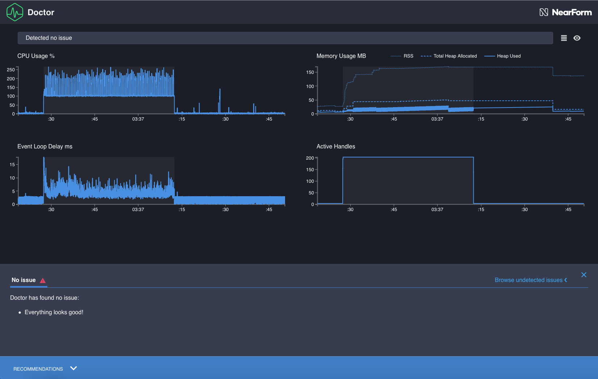

# Express.js Possible Memory Leak

Demos a possible memory leak in Express.js when running in Node 10.

## Express version

To run Express version:

```
npx clinic doctor -- node express.js
```

In a seperate session, run benchmark:

```
wrk -t 5 -c 200 -d 45s http://localhost:3000/
```

Run `(ctrl ^) + C` to kill server process and generate report when complete.


## Node.js version

```
npx clinic doctor -- node server.js
```

In a seperate session, run benchmark:

```
wrk -t 5 -c 200 -d 45s http://localhost:3000/
```

Run `(ctrl ^) + C` to kill server process and generate report when complete


